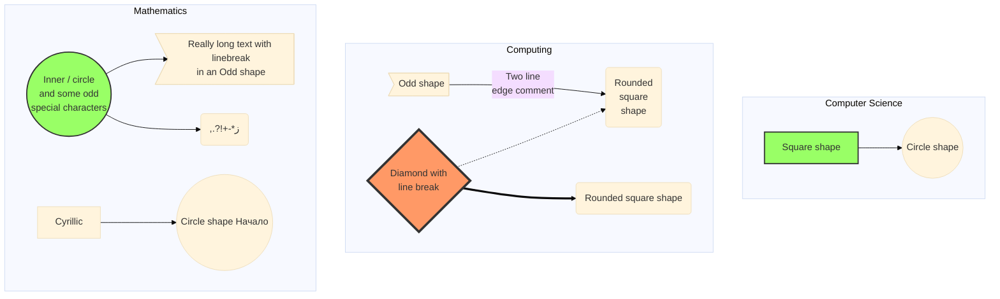

# Notes on Reasoning, Formal Logic, Mathematics, Computer Science & Software Engineering

- It can help to think of knowledge as a mutually-reinforcing web

- Seemingly unrelated concepts can have relationships to each other that strengthen your understanding of each

- Some problems are better avoided than solved

## Data Structures & Algorithms

- A few basic structures and algorithms can go a long way

- Go for quality over quantity and try spending more time breaking down more complex problems such as topological sorting while occasionally dabbling with a few simpler problems like FizzBuzz to brush up

- Node-based structures - Start with singly or doubly linked lists using arrays and smart pointers (or pointers with raw pointers with proper alloc/dealloc) and compose them into trees and graphs

- Iteration - Implement using loops and auto-optimizable tail recursion

- Combine recursive iteration with caching data structures for fancier algorithms like dynamic programming

- It's recursion all the way down

- Look into probabilistic data structures like bloom filters when you get the chance

## Finding Code Contribution Opportunities

- Explore & optimize UI to save end-users' time or reduce cognitive load

- Profile & optimize performance bottlenecks noticeable to end-users

- Explore code base, factoring in things like cyclomatic complexity, code duplication/redundancy & consistency of coding style (all three things and more can be optimized in different ways)

- Get used to quickly satisfying esoteric dependecies to build projects fast (use something like Nix, VMs, or OCI and LXC containers if needed)

- Read the contributor docs most projects come with

- Filter open issues quickly with keyword searches & tags if possible

## Axioms/Premises

- Mutually acceptable assertions that form the baseline for proving something to a real or hypothetical opponent

- Be careful with premises because untrue ones can lead to 'valid' arguments that are not 'sound' i.e. they are not true in the sense that they are completely detached from reality

- A sound argument requires a valid argument based on a true premise

## Approximation

- Scientific efforts of all kinds could be described as attempts at creating (sufficiently accurate) approximate simulations of reality for the purposes of manipulating it

- Sufficiency of accuracy depends on the context

- Understand when things are always true, never true and true or false only under certain conditions or with certain exceptions to the rule

## Levels of Certainty in a Hypothesis

- Level 1 - Solved a concrete case that allows the formation of a disprovable/falsifiable hypothesis applicable to more cases (the more the better since it means you can get more use out of previous work and old knowledge)

- Level 2 - Formulated the falsifiable hypothesis/conjecture in a format that can be brute-forced (by hand or ideally by machine) for a range (technically 'domain'?) of cases using arbitrary bounds

- Level 3 - The hypothesis/conjecture has not been falsified i.e. the program has not _halted_ after exploring a large range of values (the larger the range the stronger the possibility that it is actually true for _all_ cases in a given domain)

- Level 4 - Proved that the pattern/hypothesis holds true for _all_ cases in the domain via informal proof

- Level 5 - Proof has been peer-reviewed

- Level 6 - Proof has been machine-verified with formal proof assistants

## Typical Proof Process

- Assume a specific case and derive

- Work backwards with a general case

- Always be aware of the boundaries or constraints of what you are trying to prove such as being restricted with bound variables or the set of (among others) integers (-∞ to +∞), whole numbers (0 to +∞), or natural numbers (1 to +∞)

- For example, the odd and even concepts only apply to integers

## Dependencies

- Think of prerequisite knowledge as a DAG of dependencies

- Make it explicit when you're missing knowledge and dig deeper as needed

## Specialties of Interest

### HPC

- High-performance (parallel & concurrent) computing

#### Rendering

- Read up more on the 'pipeline' pattern for parallel programming

- Implement some software renderers and then convert them to CUDA versions for experimenting

- Graphics APIs like DirectX, OpenGL & Vulkan may be substantially easier to 'grok' after building an intuitive understanding of rendering fundamentals with 'software' rendering examples

---

### MPC

- Secure _multi-party computation_

#### Differential Privacy

- Algorithm is differntially private when its output cannot be used to identify if a particular individual entity's information was used in its computation or not

#### Zero-Knowledge Proofs

- Proving that one possesses knowledge of some information _without revealing the information itself_ or any additional information

---

### SP

- Simulation programming

#### Physics Simulation

- Bullet/PyBullet with GPGPU (CUDA) acceleration

---

### PC

- Parser combinators

- Good for when simple regular expressions become too complex or unmaintainable (which can happen more often than not)

- Use the JavaScript arcsecond library which emulates Haskell's PC style for some good examples

#### Compiler Theory

##### Metacompilers

-  META II

---
